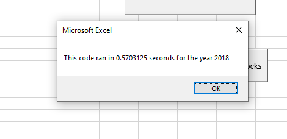

# Stockholder Analysis - Joel Robles

## Overview of Project
Utilizing a dataset of stock information from 2017-2018, a VBA script was created to perform the following functions:

* Creating an array of the stock tickers held within the dataset
* Calculating the total daily volume of each of the stocks held within the dataset
* Calculating the return of the stock by dividing the stocks ending price and starting price. 

A nested for loop was utilized to loop through each of the stock tickers held within the array created (gathering data for each of the individual stock tickers through each loop iteration). However, while this process works well for a limited set of data, looping through a larger dataset multiple times would likely take a longer amount of time. To create a baseline, a timer was created to see how long the code would take to run through each of the two times:




Utilizing these baselines, and in consideration of making the code work more efficiently for a larger dataset, the initial VBA script was refactored to make it more efficient and run more quickly. 

## Results

Instead of looping through the dataset 12 times as in the original VBA script, the decision was made to gather all of the data required for the analysis at once. To begin this process, in addition to the array created in the initial script, three other arrays were created utilizing the following code to hold the data for the 12 tickers all at once: 

```
Dim tickerVolumes(12) as Long
Dim tickerStartingPrices(12) as Single
Dim tickerEndingPrices(12) as Single
```

Each of the arrays above were created to hold 12 data points (appropriately identified for what they would hold). With these 3 arrays created (plus the initial tickers array for a total of 4), it was important to create a variable that could be utilized to reference each of the 12 data points within the 4 arrays. Additionally, with consideration towards the future, hard coded values would need to be replaced to more easily update the code in the future. To facilitate this, the following variable was created:

```
tickerIndex = 0
```

By creating this variable, we now have an index point that can reference any value within the 4 arrays created above (specifically the 0 value within the array). Furthermore, doing this now eliminated the need to create a for loop to run through the dataset 12 times as it can now be done once to gather all the required data within each of the 4 arrays (assigning values 12 times). However, because of this (and the way that the value of tickerVolumes is created (by taking a sum)), it is necessary to set the value of each of the 12 points within the tickerVolumes array to 0 before beginning to run through the data set. We can do so by utilizing a for loop:

```
For i = 0 To 11

tickerVolumes(i) = 0

Next i

```

After all of this initial set up, the dataset can be run through once and can capture all of the necessary data points at once and hold the values within each of the array's created utilizing the tickerindex variable to initiate the correct position within the array's:

```
 For j = 2 To RowCount
    
        '3a) Inside the for loop in Step 2b, write a script that increases the current tickerVolumes (stock ticker volume) variable and adds the ticker volume for the current stock ticker.
        'Use the tickerIndex variable as the index.
        
        If Cells(j, 1).Value = tickers(tickerindex) Then
        
            tickerVolumes(tickerindex) = tickerVolumes(tickerindex) + Cells(j, 8).Value
            
        End If
        
        
         '3b) Write an if-then statement to check if the current row is the first row with the selected tickerIndex.
         'If it is, then assign the current starting price to the tickerStartingPrices variable.
         
        If Cells(j - 1, 1).Value <> tickers(tickerindex) Then 'And Cells(j, 1).Value = tickers(tickerindex) Then
        
            tickerStartingPrices(tickerindex) = Cells(j, 6).Value
        
       End If
        
        '3c) Write an if-then statement to check if the current row is the last row with the selected tickerIndex.
        'If it is, then assign the current closing price to the tickerEndingPrices variable.
        
        If Cells(j + 1, 1).Value <> tickers(tickerindex) And Cells(j, 1).Value = tickers(tickerindex) Then
            
            tickerEndingPrices(tickerindex) = Cells(j, 6).Value
            
        '3d Write a script that increases the tickerIndex if the next row’s ticker doesn’t match the previous row’s ticker.
            
            tickerindex = tickerindex + 1
            
        End If
        
    Next j

```
After this for loop captures the data, we then output the data utilizing another for loop to output the correct value within the array:

```
For k = 0 To 11
        
        Worksheets("All Stocks Analysis").Activate
    
    Cells(4 + k, 1).Value = tickers(k)
    Cells(4 + k, 2).Value = tickerVolumes(k)
    Cells(4 + k, 3).Value = tickerEndingPrices(k) / tickerStartingPrices(k) - 1
    
    Next k
```
After this, we ran the code and got the following timestamp outputs:


We then analyzed our results for both 2017 and 2018 datasets:

2017 Original

* .5585938 seconds

2017 Refactored

* .109375 seconds (0.4492188 seconds improvement)

2018 Original

* .5703125 seconds

2018 Refactored

* .0859375 seconds (0.484375 seconds improvement)

As indicated above, we have improved the code's efficiency allowing it to run quicker. 

## Summary

In short, this exercise has allowed us to improve the efficiency of our code which would allow it to run more quickly on larger datasets. In general, when refactoring code, there are some advantages:

* Marked improvement of the code creating less of a burden on the system
* Can help with scalability - By removing some of the hardcoded values, the code can be added to fairly easily.

However, there is also one large disadvantage that comes to mind:

* Time invested - It would not be innacurate to state that the refactoring of this code took a bit of time. While this time will ultimately be of a benefit in the long term, there must be an initial investment of time which can take away from other more pressing issues.

In terms of the VBA script utilized here, the following advantages apply:

* More efficient. As mentioned above, the refactored code is more efficient and allows it run quicker. Therefore, when considering working with a larger dataset, the code and resulting analysis would be completed faster. 

And disadvantages: 

* Time sink - Though the refactored code is more efficient (and can be run faster), the time invested into this project is still something that should be considered. If the code will be utilized multiple times over multiple datasets, then it could be considered a good use of time and resources. However, if this dataset were to remain small or (not even used going forward) then the time invested would certainly not be a wise use of a resource. 